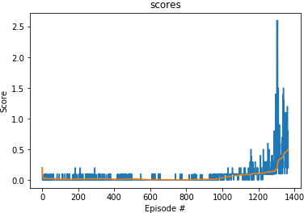
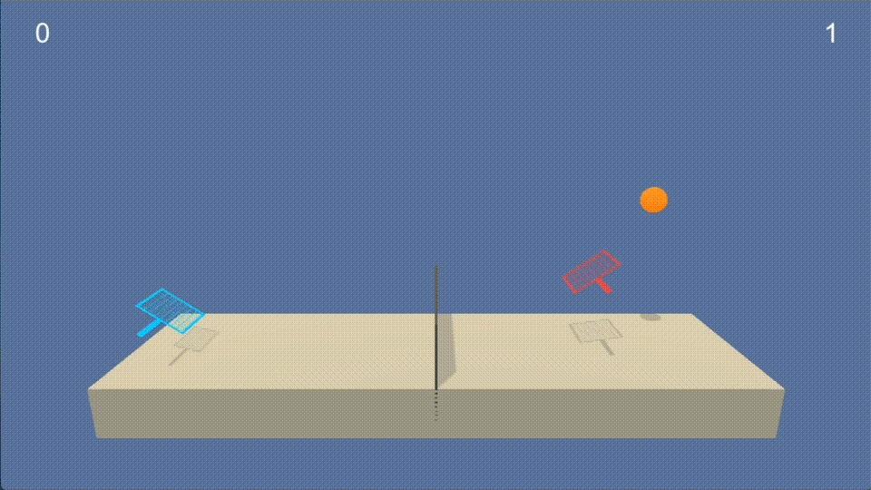

# Project context

In this project, we use the [Tennis](https://github.com/Unity-Technologies/ml-agents/blob/master/docs/Learning-Environment-Examples.md#tennis) environment in which two agents control rackets to bounce a ball over a net.

If an agent hits the ball over the net, it receives a reward of +0.1.  If an agent lets a ball hit the ground or hits the ball out of bounds, it receives a reward of -0.01.  Thus, the goal of each agent is to keep the ball in play.

The observation space consists of 8 variables corresponding to the position and velocity of the ball and racket. Each agent receives its own, local observation.  Two continuous actions are available, corresponding to movement toward (or away from) the net, and jumping.

The task is episodic, and in order to solve the environment, your agents must get an average score of +0.5 (over 100 consecutive episodes, after taking the maximum over both agents). Specifically,

- After each episode, we add up the rewards that each agent received (without discounting), to get a score for each agent. This yields 2 (potentially different) scores. We then take the maximum of these 2 scores.
- This yields a single **score** for each episode.

The environment is considered solved, when the average (over 100 episodes) of those **scores** is at least +0.5.

# Learning algorithm

We implement a multi-agent algorithm called **Multi-Agent Deep Deterministic Policy Gradients** ([MADDPG](https://arxiv.org/pdf/1706.02275.pdf)).
> It is a simple extension of actor-critic policy gradient methods where the critic is augmented with extra information about the policies of other agents.

Our MADDPG agent is composed of two DDPG agents both with actor and critic networks. The actor only observes its local state while the critic gets all the available information (states and actions of both agent). The agents share a common replay buffer to sample from. The networks' updates are applied on samples (or minibatches of size `BATCH_SIZE`) of experience drawn uniformly at random from the pool of stored samples of size `BUFFER_SIZE`.

The description of the full algorithm can be found in the Appendix of the above paper.

While we used an Ornstein-Uhlenbeck (OU) process to ensure that there is a good trade-off between exploration and exploitation in the previous project, it need not work well for this projet. We only used a random noise process with a noise decay factor here.

| Parameter | |
|-|-|
| BATCH_SIZE| 256 |
| BUFFER_SIZE | 100 000 |

# Architecture
The model architecture of the DDPG agents consists of an Actor and Critic neural network, each of two layers network with 256 and 128 hidden units.
The actor have an input state size of 24 dimensions and output actions size of 2.
The critic have an input state size of 53 (2 * 24 + 2 * 2) dimensions and output size of 1. All these layers are separated by Rectifier Linear Units (ReLu) and batch normalization. The hyperbolic tangent (tanh) is applied before the output of the actor network to ensure that values are between -1 and 1.

## Optimization
The optimization employed to train the
network is Adam with a learning rate set to `LR = 0.0001` and a weight decay set to `WEIGHT_DECAY = 0` (and other default parameters from PyTorch library) for both the actor and critic networks.

# Plot of Rewards
The environment has been solve in around 1400 episodes ! Below is the plot of the agent's rewards.

```
500 episode	 avg score 0.0211	max score 0.0000
1000 episode	avg score 0.0348	max score 0.1000
1367 episode	avg score 0.5028	max score 0.2000
Environment solved after 1367 episodes with the average score 0.5028
```



We can follow the trained agent for one episode here:


# Ideas for future works

We can obviously observe that the there is a lot of instability during training. Fine tuning the hyper-parameters can help stabilize the training.  We can tune the learning rate for actor and critic as well as the batch size. As we did not use the Ornstein-Uhlenbeck (OU) process, we can further investigate the way the noise influences the training and tune the decay factor.
